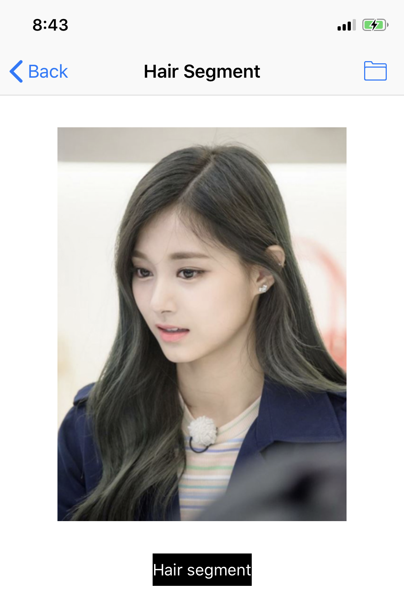
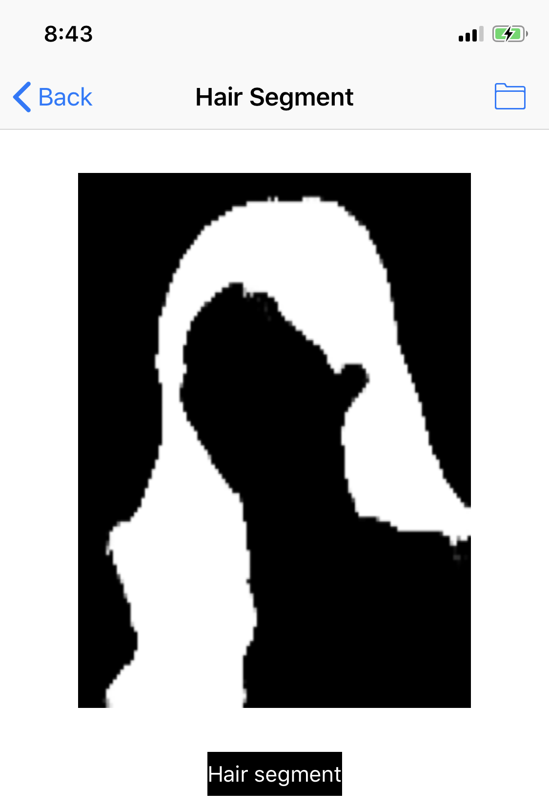
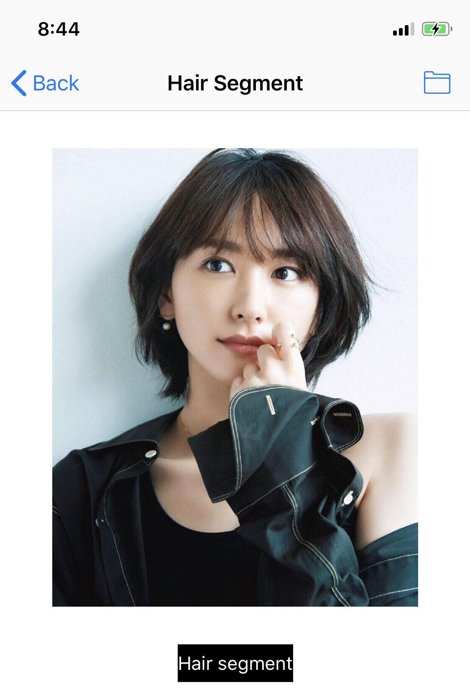
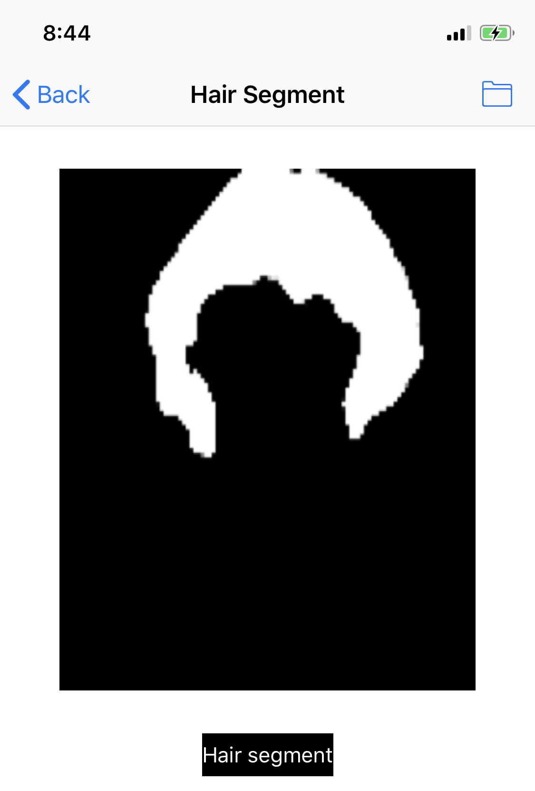

# ios-Image-Segmentation

An application of image segmentation on iOS with U-Net. The format of the model is converted from PyTorch to Core ML.

## Hair segmentation

Segment the hair from the image with U-Net.

<table>
<tr>
    <th>Original image</th>
    <th>Segmented image</th>
</tr>
<tr>
    <td></td>
    <td></td>
</tr>
</table>

<table>
<tr>
    <th>Original image</th>
    <th>Segmented image</th>
</tr>
<tr>
    <td></td>
    <td></td>
</tr>
</table>

## TODO

1. Create a repo of PyTorch model.

2. Dye the hair with OpenCV.

3. Face segmentation.

4. Backgound segmentation.

## Reference

[1] [MobileNetV2](https://arxiv.org/abs/1801.04381)

[2] [U-Net](https://arxiv.org/abs/1505.04597)
